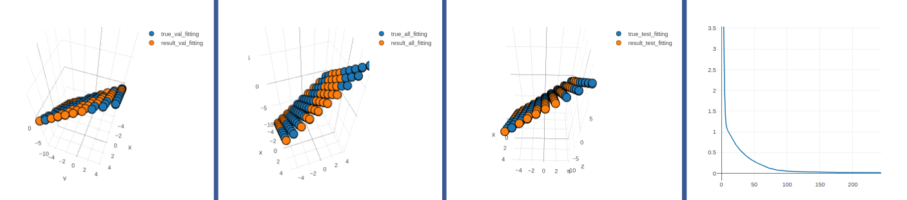
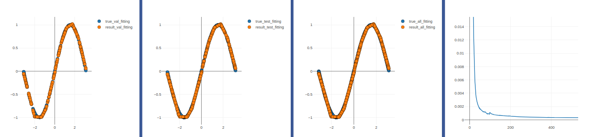
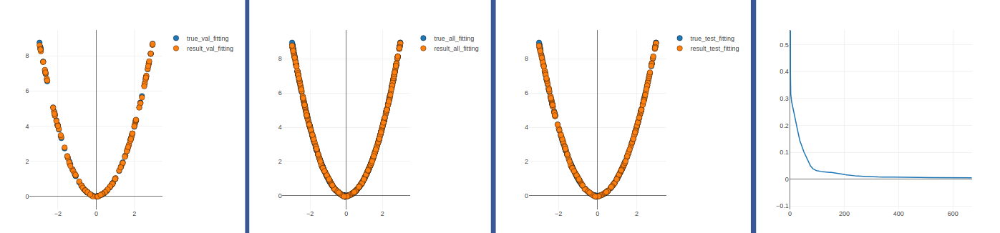

## BP Neural Network

>Author：zhiyu-Lin

>Date：2018-5-28

>E-mail: jhyxlzh@126.com

>Description: numpy实现BP算法，visdom可视化训练结果

### 文件目录结构

```
|____BP -r:5
| |____main.py
| |____activate.py
| |____BP.py
| |____dataset.py
| |____net.py
```

### 文件说明

- **main.py**-------主函数，初始化网络参数
- **activate.py**---激活函数类
- **BP.py**---------网络的训练、验证、测试以及结果图形化展示
- **dataset.py**----生成网络训练数据、验证数据、测试数据集
- **net.py**--------网络的向前传播和向后传播、网络参数更新

### 运行

```shell
$ pip install -r requirements.txt
```

main.py中网络参数初始化

```python
config = {
    
    'lr':0.01,	#学习率
    'max_epoch':1000,	#最大迭代次数
    'vis':visdom.Visdom(env=u'x2_loss_test'),	#visdom可视化
    'net':Net(1,[10,20,1],0.01,'relu'),   #网络输入维度、网络结构(2个隐藏层；1输出）、学习率、激活函数
    'data':DataSet('x2')  #数据集选择
        
 }
```

```python
python main.py
```
### 结果
>拟合y=x1+x2函数-1000个数据样本 训练集、验证集、数据集拟合曲线、loss曲线



>拟合y=sinx函数-500个数据样本 训练集、验证集、数据集拟合曲线、loss曲线



>拟合y=power(x)函数-1000个数据样本 训练集、验证集、数据集拟合曲线、loss曲线




*P.S. FEEL GOOD SHOW ME A STAR*
